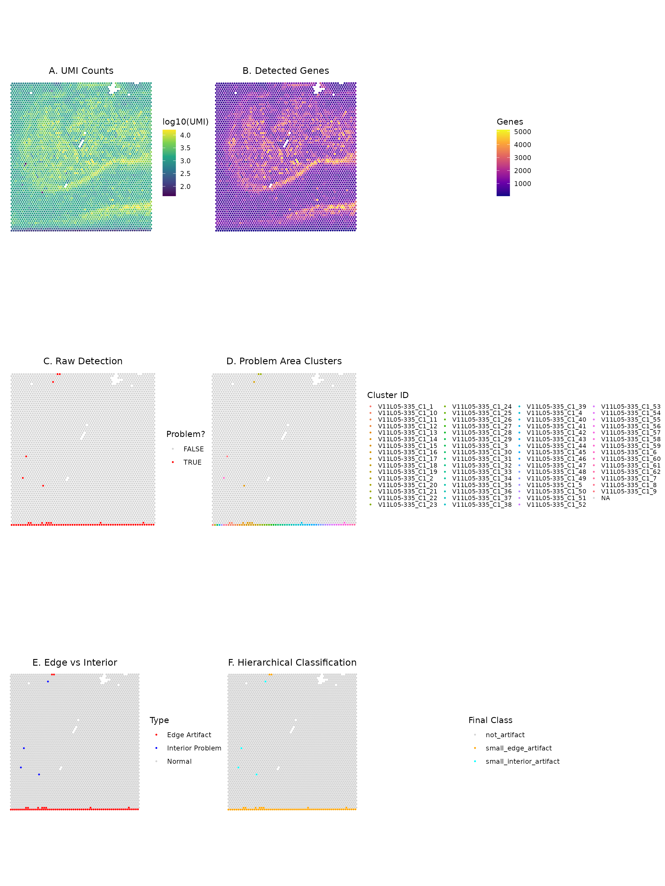
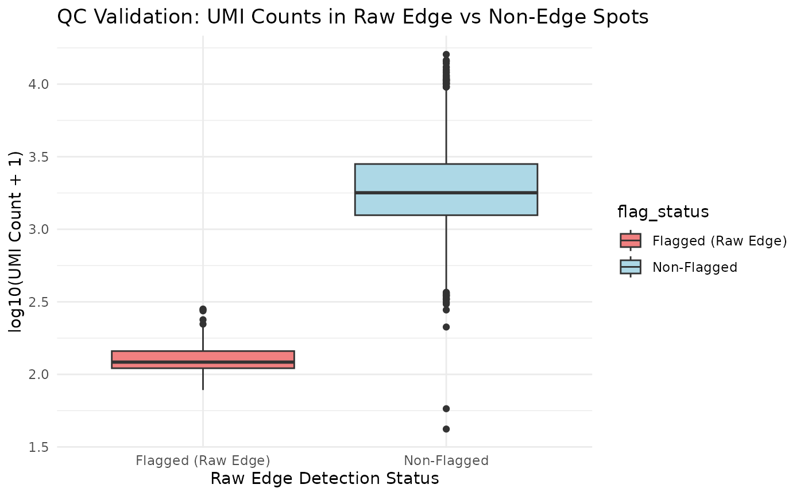
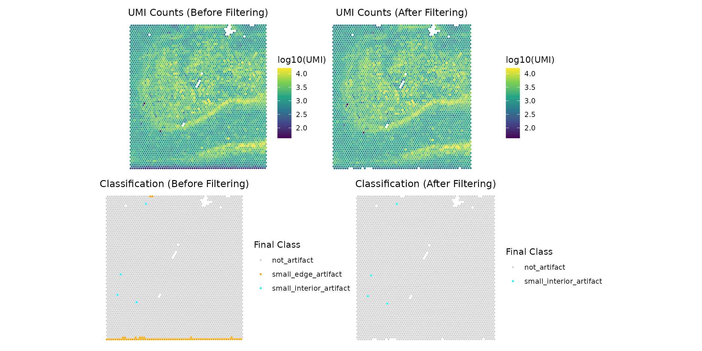

# SpatialArtifacts Tutorial

## Introduction

`SpatialArtifacts` is an R package that provides a data-driven a
two-step workflow to identify, classify, and handle spatial artifacts in
spatial transcriptomics data from multiple platforms including **10x
Visium** (Standard and HD). Broadly, the idea behind the package is we
that combine median absolute deviation (MAD)-based outlier detection
with morphological image processing to identify the artifacts. These
artifacts, often appearing as areas of low gene/UMI counts or high
mitochondrial ratio at tissue edges (**edge artifacts**) or in the
interior (**interior artifacts**), can negatively impact downstream
analyses. The methods are implemented as an R package within the
Bioconductor framework, and is available via
*[SpatialArtifacts](https://bioconductor.org/packages/3.22/SpatialArtifacts)*.

In the following, we provide an overview of the functionality in the
package and we demonstrate how to apply the package on real-world
datasets across different spatial transcriptomics platforms.

More details describing the method will be available in our upcoming
preprint.

## Installation

The latest development version can also be installed from the `devel`
version of Bioconductor:

``` r
BiocManager::install("SpatialArtifacts", version="devel")
```

``` r
install.packages("BiocManager")
BiocManager::install("SpatialArtifacts")
```

The latest development version can also be installed from the `devel`
version of Bioconductor or from
[GitHub](https://github.com/CambridgeCat13/SpatialArtifacts).

## Input data format

In the examples below, we assume the input data are provided as a
*[SpatialExperiment](https://bioconductor.org/packages/3.22/SpatialExperiment)*
Bioconductor object. In this case, the outputs are stored in the
`rowData` of the `SpatialExperiment` object.

### Platform Support

`SpatialArtifacts` is designed to work across multiple spatial
transcriptomics platforms:

- Standard Visium (55µm bins, hexagonal grid): ~5,000 spots per capture
  area
- VisiumHD 16µm (16µm bins, square grid): ~480,000 bins per capture
  area  
- VisiumHD 8µm (8µm bins, square grid): ~1,920,000 bins per capture area

> **IMPORTANT:** The morphological detection framework automatically
> adapts to different grid arrangements, but **parameter scaling is
> critical** for optimal performance across platforms.

## Two key steps

The core philosophy is a two-step process: **detect, and then
classify**. This separates the sensitive task of identifying all
potential problem spots from the more nuanced task of deciding what to
do with them.

### The detection phase

In the first step, we use the
[`detectEdgeArtifacts()`](https://cambridgecat13.github.io/SpatialArtifacts/reference/detectEdgeArtifacts.md)
function. Here, the goal is to identify all spots that could potentially
be part of an artifact.

How does it work:

- **Outlier identification**: Find spots with abnormally low QC metrics
  (e.g., `sum_gene`) using a Median Absolute Deviation (MAD)
  threshold.  
- **Morphological cleaning**: Apply sequential raster-based focal
  operations through
  [`focal_transformations()`](https://cambridgecat13.github.io/SpatialArtifacts/reference/focal_transformations.md):
  1.  **3×3 fill** (`my_fill`): Fill spots completely surrounded by
      outliers
  2.  **5×5 outline** (`my_outline`): Fill spots outlined by outliers in
      a larger 16-pixel perimeter
  3.  **Star pattern** (`my_fill_star`): Fill spots with outliers in all
      four cardinal directions (N, S, E, W)
  4.  **Small cluster removal**: Remove isolated normal regions below
      `min_cluster_size` threshold (default: 40 spots)

  - Use 8-directional connectivity for connected component analysis
- **Cluster detection**: Group these outliers into contiguous “problem
  areas” (`problemAreas`)
- **Edge identification**: Evaluate whether clusters touch tissue
  boundaries using
  [`clumpEdges()`](https://cambridgecat13.github.io/SpatialArtifacts/reference/clumpEdges.md).
  For each of the four borders (north, south, east, west), calculates
  the proportion of boundary spots belonging to each cluster. A cluster
  is classified as an edge artifact if this proportion meets or exceeds
  `edge_threshold` (default: 0.75, meaning ≥75% border coverage) on any
  single border direction

The output from this phase will add three *raw* columns to your `spe`
object: `_edge`, `_problem_id`, and `_problem_size`

### The classification phase

In the second step, we use the
[`classifyEdgeArtifacts()`](https://cambridgecat13.github.io/SpatialArtifacts/reference/classifyEdgeArtifacts.md)
function. Here the goal is to take the raw detections from the previous
step and apply a clear, hierarchical logic to assign final labels.

How does it work:

- **Input**: Requires the `spe` object processed by
  [`detectEdgeArtifacts()`](https://cambridgecat13.github.io/SpatialArtifacts/reference/detectEdgeArtifacts.md)  
- **Hierarchical Classification**: Apply a 2×2 logic system based on
  **Location** and **Size**:
  1.  **Location**: Is the artifact an `_edge_artifact` (`TRUE` or
      `FALSE`) based on the detection step?  
  2.  **Size**: Is the artifact’s `_problem_size` larger than
      `min_spots` (default: `20`)?  
- **Label Assignment**: This logic produces five intuitive categories:
  - `"not_artifact"` — High-quality spots  
  - `"large_edge_artifact"` — Large artifact cluster (`> min_spots`)
    touching the tissue edge  
  - `"small_edge_artifact"` — Small artifact cluster (`≤ min_spots`)
    touching the tissue edge  
  - `"large_interior_artifact"` — Large artifact cluster (`> min_spots`)
    located inside the tissue  
  - `"small_interior_artifact"` — Small artifact cluster (`≤ min_spots`)
    located inside the tissue

The output from this phase will add one classification column named
`_classification`.

## Helpful information on parameters

Tuning the parameters lets you adapt the workflow to different tissue
types, data quality, and spatial transcriptomics platforms. The package
uses a wrapper function that routes to platform-specific
implementations.

### Platform selection

**CRITICAL FIRST STEP:** Specify your platform using the `platform`
parameter in
[`detectEdgeArtifacts()`](https://cambridgecat13.github.io/SpatialArtifacts/reference/detectEdgeArtifacts.md)
function:

| Platform            | Function Call                                                           | Required Parameters            |
|---------------------|-------------------------------------------------------------------------|--------------------------------|
| **Standard Visium** | `detectEdgeArtifacts(spe, platform="visium", ...)`                      | (none required)                |
| **VisiumHD**        | `detectEdgeArtifacts(spe, platform="visiumhd", resolution="16um", ...)` | `resolution` (“8um” or “16um”) |

### Example use cases

``` r
# Standard Visium (55µm hexagonal grid)
spe <- detectEdgeArtifacts(spe, platform = "visium", ...)

# VisiumHD 16µm (square grid)
spe <- detectEdgeArtifacts(spe, platform = "visiumhd", resolution = "16um", ...)

# VisiumHD 8µm (square grid)
spe <- detectEdgeArtifacts(spe, platform = "visiumhd", resolution = "8um", ...)
```

### Parameters for `detectEdgeArtifacts()`

The wrapper function accepts platform-specific parameters that are
routed to the appropriate implementation.

#### For all platforms

- `platform` (**REQUIRED**) – Character string: `"visium"` or
  `"visiumhd"` (case insensitive)

  - Determines which platform-specific function to use
  - No default value; must be explicitly specified for clarity

- `qc_metric` (Default: `"sum_gene"`) – Column name for QC metric used
  in outlier detection

  - Common alternatives: `"sum_umi"`, `"detected"`, `"nFeature"`
  - The function will auto-detect some common variants

- `samples` (Default: `"sample_id"`) – Column name for sample
  identifiers

  - Each sample is processed independently

- `mad_threshold` (Default: 3) – Sensitivity for detecting outliers

  - Lower values (1.5–2) are more sensitive
  - Higher values (3–4) are more conservative

- `name` (Default: `"edge_artifact"`) – Prefix for output column names

  - Outputs: `[name]_edge`, `[name]_problem_id`, `[name]_problem_size`

- `verbose` (Default: `TRUE`) – Print progress messages

- `keep_intermediate` (Default: `FALSE`) – Retain intermediate outlier
  detection columns

#### For standard Visium

When `platform = "visium"`, use:

- `edge_threshold` (Default: 0.75) – Minimum proportion of a tissue
  boundary that must be occupied by outlier clusters (collectively) for
  those clusters to be classified as edge artifacts.

  **Important Behavior:** The threshold is applied to the **total
  coverage** of all outlier clusters on each boundary direction (North,
  South, East, West). If multiple clusters collectively cover ≥
  `edge_threshold` of a boundary, **all clusters touching that
  boundary** are classified as edge artifacts, even if no single cluster
  meets the threshold individually.

  **Example Scenario:**

  - North boundary contains 100 spots total
  - Cluster A occupies 30 boundary spots (30% coverage)
  - Cluster B occupies 50 boundary spots (50% coverage)
  - Combined coverage: 80% ≥ 75% threshold
  - **Result:** Both Cluster A and Cluster B are classified as edge
    artifacts

  **Rationale:** Edge drying artifacts typically affect large,
  continuous regions along tissue boundaries. Multiple clusters on the
  same boundary often result from a single underlying technical failure
  (incomplete permeabilization) and should be treated as a unified
  artifact rather than independent events.

  **Tuning Guidance:**

  - Higher values (0.75–0.90): More conservative, captures only
    large-scale boundary failures
  - Lower values (0.40–0.60): More sensitive, may flag smaller
    boundary-adjacent regions
  - Very low values (\<0.30): Aggressive, may misclassify biological
    low-expression zones as artifacts

- `min_cluster_size` (Default: 40) – Minimum cluster size (in spots) for
  morphological cleaning during focal transformation steps

  - Isolated “normal” regions smaller than this threshold within outlier
    areas will be filled in to create contiguous artifact regions
  - **For Standard Visium:** 40 spots ≈ 0.12 mm² physical area

- `shifted` (Default: `FALSE`) – Apply coordinate adjustment for
  hexagonal grid alignment

  - Keep the default FALSE when using array_row/array_col coordinates
    from Space Ranger, as rasterFromXYZ handles the hexagonal grid
    spacing automatically.
  - Only set to TRUE if using a custom coordinate system where odd
    columns require manual offset correction.

- `batch_var` (Default: `"both"`) – Determines grouping for MAD
  calculation

  - Options: `"sample_id"`, `"slide"`, or `"both"`
  - `"both"`: Spots flagged as outliers if below threshold in either
    sample or slide grouping

#### For VisiumHD

When `platform = "visiumhd"`, use:

- `resolution` (**REQUIRED**) – Character string: `"8um"` or `"16um"`
  - Specifies the bin size of your VisiumHD data
  - This is **mandatory** for VisiumHD; the function will error if not
    provided
  - Determines conversion from physical units (µm) to bins
- `buffer_width_um` (Default: 80) – Buffer zone width in micrometers
  (physical units)
  - Defines the edge region where artifacts are expected
  - Automatically converted to bins based on `resolution`:
    - At 16µm resolution: 80 µm → 5 bins
    - At 8µm resolution: 80 µm → 10 bins
  - **Tuning guidance:**
    - Increase (100-150 µm) for tissues with larger edge artifacts
    - Decrease (50-60 µm) for precise edge detection
- `min_cluster_area_um2` (Default: 1280) – Minimum cluster area in
  square micrometers (physical units)
  - Clusters smaller than this will be filtered out during morphological
    cleaning
  - Automatically converted to bins based on `resolution`:
    - At 16µm resolution: 1280 µm² → 5 bins (16×16 µm per bin)
    - At 8µm resolution: 1280 µm² → 20 bins (8×8 µm per bin)
  - **Physical consistency:** Same area threshold gives different bin
    counts at different resolutions
  - Default (1280 µm²) was calibrated for 16µm resolution
- `col_x` and `col_y` (Default: `"array_col"`, `"array_row"`) – Column
  names for bin coordinates
  - **Important:** These should be **bin indices**, not pixel
    coordinates
  - Using bin indices is much more memory-efficient than pixel
    coordinates

**Key Difference from Visium**: VisiumHD parameters are specified in
**physical units (µm, µm²)** rather than bin counts. This ensures
consistency across resolutions while the algorithm handles the bin
conversion internally.

### Parameters for `classifyEdgeArtifacts()`

The classification step is **platform-independent** but requires
appropriate parameter scaling.

- `min_spots` (Default: 20) – **CRITICAL PARAMETER:** Threshold (in
  number of spots/bins) to distinguish `"large"` from `"small"`
  artifacts

  **Platform-Specific Scaling Required:**

  This parameter must be adjusted based on spatial resolution to
  represent equivalent **physical artifact sizes**:

  | Platform                   | Recommended `min_spots` | Physical Area    | Scaling Factor |
  |----------------------------|-------------------------|------------------|----------------|
  | **Standard Visium (55µm)** | `20-40`                 | ~0.06-0.12 mm²   | Baseline (1×)  |
  | **VisiumHD 16µm bins**     | `100-200`               | ~0.026-0.051 mm² | ~6-10× Visium  |
  | **VisiumHD 8µm bins**      | `400-800`               | ~0.026-0.051 mm² | ~20-40× Visium |

  **Automatic Scaling Formula:**

  ``` r
  min_spots_HD <- min_spots_visium × (55 / bin_size_µm)²

  # Example: For min_spots = 30 on Standard Visium
  # VisiumHD 16µm: 30 × (55/16)² ≈ 354 bins
  # VisiumHD 8µm:  30 × (55/8)²  ≈ 1,420 bins
  ```

  **Why scaling matters:** The same physical artifact (e.g., 0.1 mm²
  edge dryspot) will cover:

  - Standard Visium: ~33 spots
  - VisiumHD 16µm: ~390 bins  
  - VisiumHD 8µm: ~1,560 bins

  Without scaling, large VisiumHD artifacts would be incorrectly
  classified as “small.”

- `qc_metric` (Default: `"sum_umi"`) – QC metric column for validation
  (must exist but not directly used in classification logic)

- `samples` (Default: `"sample_id"`) – Sample ID column name

- `exclude_slides` (Default: `NULL`) – Vector of slide IDs to exclude
  from edge classification

  - Spots on these slides will have edge artifact status set to `FALSE`

- `name` (Default: `"edge_artifact"`) – Must match the name used in
  [`detectEdgeArtifacts()`](https://cambridgecat13.github.io/SpatialArtifacts/reference/detectEdgeArtifacts.md)

### **Platform Comparison Summary**

| Feature                            | Standard Visium                   | VisiumHD                            |
|------------------------------------|-----------------------------------|-------------------------------------|
| **Grid Type**                      | Hexagonal                         | Square                              |
| **Requires `shifted`?**            | No (default FALSE)                | No (not used)                       |
| **Resolution Parameter**           | Not applicable                    | **Required** (`"8um"` or `"16um"`)  |
| **Edge Detection Method**          | Morphological + boundary coverage | Buffer zone + morphological         |
| **Parameter Units**                | Spot counts                       | Physical units (µm, µm²)            |
| **Default `min_spots` (classify)** | 20-40                             | 100-200 (16µm), 400-800 (8µm)       |
| **Typical Dataset Size**           | ~5,000 spots                      | ~480k bins (16µm), ~1.9M bins (8µm) |

### Understanding the output columns

After both functions, several columns are added to `colData(spe)`:

- **`*_edge`** – Raw detection: Is the spot in a cluster touching the
  tissue border? (TRUE/FALSE)  
- **`*_problem_id`** – Raw detection: ID of the problem area.  
- **`*_problem_size`** – Raw detection: Size (number of spots) of the
  problem area.  
- `*_true_edges` — **Intermediate:** Edge status after applying
  `exclude_slides` (used by
  [`classifyEdgeArtifacts()`](https://cambridgecat13.github.io/SpatialArtifacts/reference/classifyEdgeArtifacts.md)).
- `*_classification` — **Final classification:** One of
  `"not_artifact"`, `"large_edge_artifact"`, `"small_edge_artifact"`,
  `"large_interior_artifact"`, or `"small_interior_artifact"`.

## Example: Standard Visium workflow

This package includes `spe_vignette`, a lightweight `SpatialExperiment`
object derived from a human hippocampus Visium sample.

**This vignette will load this raw-like object and run the full
`SpatialArtifacts` workflow on it live.**

**Note:** To meet package size requirements (\< 5MB), this object has
been subset (e.g., to coding genes) and sparsified, but **no artifact
detection has been run.** We will perform those steps now.

### Data preparation: converting to dense matrix

The underlying spatial clustering functions in this package currently
require a **dense matrix** to perform coordinate-based calculations. We
must first convert the sparse `counts` assay in our `spe_vignette`
object to a standard (dense) matrix.

``` r
data(spe_vignette)
# Loaded data dimensions:
dim(spe_vignette)
#> [1] 12971  4965

assay(spe_vignette, "counts") <- as.matrix(assay(spe_vignette, "counts"))
names(colData(spe_vignette))[names(colData(spe_vignette)) == "sum"] <- "sum_umi"

spe_detected <- detectEdgeArtifacts(
  spe_vignette,
  platform = "visium", # IMPORTANT: Specify Standard Visium platform
  qc_metric = "sum_umi",
  samples = "sample_id",
  batch_var = "sample_id",
  mad_threshold = 3,
  edge_threshold = 0.75,
  name = "edge_artifact"
)
#> Detecting edges...
#>   Sample V11L05-335_C1: 74 edge spots detected
#> Finding problem areas...
#> Removed intermediate columns: lg10_sum_umi, sum_umi_3MAD_outlier_sample, sum_umi_3MAD_outlier_binary
#> Edge artifact detection completed!
#>   Total edge spots: 74
#>   Total problem area spots: 78

# === RESULTS ===
table(Edge_Detected = spe_detected$edge_artifact_edge)
#> Edge_Detected
#> FALSE  TRUE 
#>  4891    74

# Classification with Standard Visium parameters
spe_classified <- classifyEdgeArtifacts(
  spe_detected,
  min_spots = 20,
  name = "edge_artifact"
)
#> Classifying artifacts spots...
#> Classification added: edge_artifact_classification
#> 
#> Classification summary:
#>   not_artifact: 4887 spots
#>   small_edge_artifact: 74 spots
#>   small_interior_artifact: 4 spots

# === Classification Results ===
table(spe_classified$edge_artifact_classification)
#> 
#>            not_artifact     small_edge_artifact small_interior_artifact 
#>                    4887                      74                       4
```

### VisiumHD Workflow Example

For VisiumHD data, the workflow is identical **except for parameter
scaling**. Here’s a complete example showing how to adapt parameters for
VisiumHD:

#### VisiumHD 16µm Resolution Example

``` r
# This is a pseudo-example demonstrating VisiumHD 16µm workflow
# Assumes you have loaded a VisiumHD SpatialExperiment object as 'spe_hd16'

# Step 1: Ensure required QC metrics are calculated
library(scuttle)
spe_hd16 <- addPerCellQCMetrics(spe_hd16)

# Step 2: Detection Phase - VisiumHD uses square grid (no 'shifted' needed)
spe_hd16_detected <- detectEdgeArtifacts(
  spe_hd16,
  platform = "visiumhd", # Specify VisiumHD platform
  resolution = "16um", # REQUIRED for VisiumHD
  qc_metric = "sum_umi", # or "sum" depending on your colData
  samples = "sample_id",
  buffer_width_um = 100, # VisiumHD-specific parameter
  mad_threshold = 2.5,
  edge_threshold = 0.75,
  name = "edge_artifact"
)

# Step 3: Classification Phase - CRITICAL: Scale min_spots for VisiumHD resolution
# For 16µm bins, use ~6-10× the Standard Visium threshold
min_spots_16um <- 30 * (55 / 16)^2 # ≈ 354 bins

spe_hd16_classified <- classifyEdgeArtifacts(
  spe_hd16_detected,
  qc_metric = "sum_umi",
  min_spots = round(min_spots_16um), # ~350 bins
  name = "edge_artifact"
)

# Visualization (same approach as Standard Visium)
table(spe_hd16_classified$edge_artifact_classification)
```

#### VisiumHD 8µm Resolution Example

``` r
# This is a pseudo-example demonstrating VisiumHD 8µm workflow
# Assumes you have loaded a VisiumHD 8µm SpatialExperiment object as 'spe_hd8'

# Step 1: QC metrics
spe_hd8 <- addPerCellQCMetrics(spe_hd8)

# Step 2: Detection Phase
spe_hd8_detected <- detectEdgeArtifacts(
  spe_hd8,
  platform = "visiumhd", # Specify VisiumHD platform
  resolution = "8um", # REQUIRED: Specify 8µm resolution
  qc_metric = "sum_umi",
  samples = "sample_id",
  buffer_width_um = 100, # Buffer zone in micrometers
  mad_threshold = 2.5,
  edge_threshold = 0.75,
  name = "edge_artifact"
)

# Step 3: Classification with 8µm-appropriate threshold
# For 8µm bins, use ~20-40× the Standard Visium threshold
min_spots_8um <- 30 * (55 / 8)^2 # ≈ 1,420 bins

spe_hd8_classified <- classifyEdgeArtifacts(
  spe_hd8_detected,
  qc_metric = "sum_umi",
  min_spots = round(min_spots_8um), # ~1,400 bins
  name = "edge_artifact"
)

table(spe_hd8_classified$edge_artifact_classification)
```

#### Key VisiumHD Considerations

**Platform-Specific Function Calls:**

| Platform            | Function Call                                                      | Required Parameters |
|---------------------|--------------------------------------------------------------------|---------------------|
| **Standard Visium** | `detectEdgeArtifacts(..., platform="visium")`                      | (none required)     |
| **VisiumHD 16µm**   | `detectEdgeArtifacts(..., platform="visiumhd", resolution="16um")` | `resolution`        |
| **VisiumHD 8µm**    | `detectEdgeArtifacts(..., platform="visiumhd", resolution="8um")`  | `resolution`        |

**Parameter Recommendations by Platform:**

| Parameter              | Standard Visium | VisiumHD 16µm            | VisiumHD 8µm    |
|------------------------|-----------------|--------------------------|-----------------|
| `platform`             | `"visium"`      | `"visiumhd"`             | `"visiumhd"`    |
| `resolution`           | N/A (not used)  | `"16um"`                 | `"8um"`         |
| `shifted`              | FALSE (default) | N/A (handled internally) | N/A             |
| `buffer_width_um`      | N/A             | `100` (default)          | `100` (default) |
| `mad_threshold`        | 1.5-3.0         | 2.0-3.0                  | 2.0-3.0         |
| `min_spots` (classify) | 20-40           | 100-200                  | 400-800         |
| Grid Type              | Hexagonal       | Square                   | Square          |

### Visualization: QC Metrics and Detection Results

We’ll create a comprehensive visualization showing QC metrics, detection
results, and detailed cluster information:

``` r
library(SpatialExperiment)
library(patchwork)

plot_data <- as.data.frame(colData(spe_classified))
plot_data <- cbind(plot_data, as.data.frame(spatialCoords(spe_classified)))
plot_data_in_tissue <- plot_data[plot_data$in_tissue, ]

base_theme <- theme_void() +
  theme(plot.title = element_text(size = 12, hjust = 0.5), legend.position = "right")

.plt <- \(df, col, fun = \(.) .) {
  ggplot(df, aes(x = pxl_col_in_fullres, y = pxl_row_in_fullres, col = fun(.data[[col]]))) +
    geom_point(size = 0.5) +
    base_theme +
    coord_fixed()
}

plot_data_in_tissue$raw_problem <- !is.na(plot_data_in_tissue$edge_artifact_problem_id)
plot_data_in_tissue$cluster_display <- plot_data_in_tissue$edge_artifact_problem_id
plot_data_in_tissue$artifact_type <- "Normal"
plot_data_in_tissue$artifact_type[plot_data_in_tissue$edge_artifact_edge] <- "Edge Artifact"
plot_data_in_tissue$artifact_type[!is.na(plot_data_in_tissue$edge_artifact_problem_id) & !plot_data_in_tissue$edge_artifact_edge] <- "Interior Problem"

p1 <- .plt(plot_data_in_tissue, "sum_umi", \(.) log10(.+1)) + 
  scale_color_viridis_c(name = "log10(UMI)") + ggtitle("A. UMI Counts")

p2 <- .plt(plot_data_in_tissue, "detected") + 
  scale_color_viridis_c(name = "Genes", option = "plasma") + ggtitle("B. Detected Genes")

p3 <- .plt(plot_data_in_tissue, "raw_problem") + 
  scale_color_manual(values = c("FALSE" = "lightgray", "TRUE" = "red"), name = "Problem?") + ggtitle("C. Raw Detection")

p4 <- .plt(plot_data_in_tissue, "cluster_display") + 
  scale_color_discrete(name = "Cluster ID", na.value = "lightgray") + ggtitle("D. Problem Area Clusters") + theme(legend.key.size = unit(0.3, "cm"), legend.text = element_text(size = 8))

p5 <- .plt(plot_data_in_tissue, "artifact_type") + 
  scale_color_manual(values = c("Normal" = "lightgray", "Edge Artifact" = "red", "Interior Problem" = "blue"), name = "Type") + ggtitle("E. Edge vs Interior")

p6 <- .plt(plot_data_in_tissue, "edge_artifact_classification") + 
  scale_color_manual(values = c("not_artifact" = "lightgray", "large_edge_artifact" = "red", "small_edge_artifact" = "orange", "large_interior_artifact" = "blue", "small_interior_artifact" = "cyan"), name = "Final Class", na.value = "grey50") + ggtitle("F. Hierarchical Classification")

(p1 | p2) / (p3 | p4) / (p5 | p6)
```



### Classification Summary

Let’s examine the enhanced classification system:

#### Final Classification Summary

| Classification          | Count | Percentage |
|:------------------------|------:|:-----------|
| not_artifact            |  4887 | 98.43%     |
| small_edge_artifact     |    74 | 1.49%      |
| small_interior_artifact |     4 | 0.08%      |

Classification Breakdown

#### Raw Edge Detection Summary

| Flagged_As_Edge | Count | Percentage |
|:----------------|------:|:-----------|
| FALSE           |  4891 | 98.51%     |
| TRUE            |    74 | 1.49%      |

Raw Detection Breakdown

### Quality Control Validation

Finally, let’s validate that flagged spots have lower quality metrics:

| Metric                | Flagged (Edge) | Non-flagged | Difference |
|:----------------------|---------------:|------------:|-----------:|
| Median UMI            |            120 |        1784 |       1664 |
| Median Detected Genes |            106 |        1019 |        912 |

QC Validation: Flagged vs Non-flagged Spots



### Filtering Out Problematic Spots (Optional)

Based on the new classifications, users can make informed decisions
about filtering. For example, you might decide to remove all **edge
artifacts** (both large and small) while keeping **interior artifacts**
for further review.

Here’s how you can filter the `SpatialExperiment` object to remove all
spots classified as both `"large_edge_artifact"` or
`"small_edge_artifact"`:

``` r
if ("edge_artifact_classification" %in% names(colData(spe_classified))) {
  spots_to_keep <- !spe_classified$edge_artifact_classification %in% 
    c("large_edge_artifact", "small_edge_artifact")
  spe_filtered <- spe_classified[, spots_to_keep]
  message("Original number of spots: ", ncol(spe_classified))
  message("Number of spots after filtering: ", ncol(spe_filtered))
} else {
  message("Classification column not found. Filtering step skipped.")
}
#> Original number of spots: 4965
#> Number of spots after filtering: 4891
```

``` r
plot_data_before <- as.data.frame(colData(spe_classified))
plot_data_before <- cbind(plot_data_before, as.data.frame(spatialCoords(spe_classified)))
plot_data_before_in_tissue <- plot_data_before[plot_data_before$in_tissue, ]

plot_data_after <- as.data.frame(colData(spe_filtered))
if (ncol(spe_filtered) > 0) {
  plot_data_after <- cbind(plot_data_after, as.data.frame(spatialCoords(spe_filtered)))
}

p1_umi_before <- .plt(plot_data_before_in_tissue, "sum_umi", \(.) log10(.+1)) +
  scale_color_viridis_c(name = "log10(UMI)") + ggtitle("UMI Counts (Before Filtering)")

p3_class_before <- .plt(plot_data_before_in_tissue, "edge_artifact_classification") +
  scale_color_manual(values = c("not_artifact" = "lightgray", "large_edge_artifact" = "red", "small_edge_artifact" = "orange", "large_interior_artifact" = "blue", "small_interior_artifact" = "cyan"), name = "Final Class", na.value = "grey50", drop = FALSE) + ggtitle("Classification (Before Filtering)")

if (ncol(spe_filtered) > 0) {
  p2_umi_after <- .plt(plot_data_after, "sum_umi", \(.) log10(.+1)) +
    scale_color_viridis_c(name = "log10(UMI)") + ggtitle("UMI Counts (After Filtering)")
    
  p4_class_after <- .plt(plot_data_after, "edge_artifact_classification") +
    scale_color_manual(values = c("not_artifact" = "lightgray", "large_edge_artifact" = "red", "small_edge_artifact" = "orange", "large_interior_artifact" = "blue", "small_interior_artifact" = "cyan"), name = "Final Class", na.value = "grey50", drop = FALSE) + ggtitle("Classification (After Filtering)")
} else {
  p2_umi_after <- ggplot() + theme_void() + ggtitle("UMI Counts (After Filtering - No Spots)")
  p4_class_after <- ggplot() + theme_void() + ggtitle("Classification (After Filtering - No Spots)")
}

combined_filtering_plot_2x2 <- (p1_umi_before | p2_umi_after) / (p3_class_before | p4_class_after)
print(combined_filtering_plot_2x2)
```



### Conclusion

This vignette demonstrated the **SpatialArtifacts** workflow across
multiple spatial transcriptomics platforms. Specifically, it showed:

- **Standard Visium workflow:** Complete example using the included
  hippocampus dataset
- **VisiumHD adaptation:** How to properly scale parameters for 16µm and
  8µm resolution data  
- **Platform-specific considerations:** Grid arrangement, parameter
  scaling formulas, and typical artifact sizes
- **Visualization:** Display hierarchical classification results
  alongside QC metrics  
- **Classification logic:** Distinguish between edge vs. interior and
  large vs. small artifacts
- **Validation:** Flagged spots show significantly lower molecular
  capture

**Key Takeaways for Multi-Platform Usage:**

1.  **Grid Structure:** Standard Visium uses hexagonal grids (shifted =
    FALSE by default), while VisiumHD uses square grids (shifted
    parameter not used)

2.  **Critical Parameter Scaling:** The `min_spots` threshold in
    [`classifyEdgeArtifacts()`](https://cambridgecat13.github.io/SpatialArtifacts/reference/classifyEdgeArtifacts.md)
    must scale with spatial resolution:

    - Use the formula:
      `min_spots_HD = min_spots_visium × (55 / bin_size)²`
    - Without scaling, artifacts will be incorrectly classified by size

3.  **Morphological Framework:** The same detection logic works across
    platforms, automatically adapting to different grid arrangements

4.  **Physical Consistency:** Scaled parameters ensure that “large” and
    “small” artifact classifications represent equivalent physical sizes
    regardless of platform

Overall, **SpatialArtifacts** provides a unified, platform-agnostic
framework for detecting and classifying spatial artifacts, enabling
consistent quality control across the evolving spatial transcriptomics
technology landscape.

### Session Information

``` r
sessionInfo()
#> R version 4.5.3 (2026-03-11)
#> Platform: x86_64-pc-linux-gnu
#> Running under: Ubuntu 24.04.4 LTS
#> 
#> Matrix products: default
#> BLAS:   /usr/lib/x86_64-linux-gnu/openblas-pthread/libblas.so.3 
#> LAPACK: /usr/lib/x86_64-linux-gnu/openblas-pthread/libopenblasp-r0.3.26.so;  LAPACK version 3.12.0
#> 
#> locale:
#>  [1] LC_CTYPE=C.UTF-8       LC_NUMERIC=C           LC_TIME=C.UTF-8       
#>  [4] LC_COLLATE=C.UTF-8     LC_MONETARY=C.UTF-8    LC_MESSAGES=C.UTF-8   
#>  [7] LC_PAPER=C.UTF-8       LC_NAME=C              LC_ADDRESS=C          
#> [10] LC_TELEPHONE=C         LC_MEASUREMENT=C.UTF-8 LC_IDENTIFICATION=C   
#> 
#> time zone: UTC
#> tzcode source: system (glibc)
#> 
#> attached base packages:
#> [1] stats4    stats     graphics  grDevices utils     datasets  methods  
#> [8] base     
#> 
#> other attached packages:
#>  [1] dplyr_1.2.1                 patchwork_1.3.2            
#>  [3] ggplot2_4.0.2               SpatialArtifacts_0.99.10   
#>  [5] SpatialExperiment_1.20.0    SingleCellExperiment_1.32.0
#>  [7] SummarizedExperiment_1.40.0 Biobase_2.70.0             
#>  [9] GenomicRanges_1.62.1        Seqinfo_1.0.0              
#> [11] IRanges_2.44.0              S4Vectors_0.48.1           
#> [13] BiocGenerics_0.56.0         generics_0.1.4             
#> [15] MatrixGenerics_1.22.0       matrixStats_1.5.0          
#> [17] BiocStyle_2.38.0           
#> 
#> loaded via a namespace (and not attached):
#>  [1] gtable_0.3.6        rjson_0.2.23        xfun_0.57          
#>  [4] bslib_0.10.0        lattice_0.22-9      vctrs_0.7.3        
#>  [7] tools_4.5.3         parallel_4.5.3      tibble_3.3.1       
#> [10] pkgconfig_2.0.3     Matrix_1.7-4        RColorBrewer_1.1-3 
#> [13] S7_0.2.1-1          desc_1.4.3          lifecycle_1.0.5    
#> [16] compiler_4.5.3      farver_2.1.2        textshaping_1.0.5  
#> [19] terra_1.9-11        codetools_0.2-20    htmltools_0.5.9    
#> [22] sass_0.4.10         yaml_2.3.12         pkgdown_2.2.0      
#> [25] pillar_1.11.1       jquerylib_0.1.4     BiocParallel_1.44.0
#> [28] DelayedArray_0.36.1 cachem_1.1.0        magick_2.9.1       
#> [31] abind_1.4-8         tidyselect_1.2.1    digest_0.6.39      
#> [34] bookdown_0.46       labeling_0.4.3      fastmap_1.2.0      
#> [37] grid_4.5.3          cli_3.6.6           SparseArray_1.10.10
#> [40] magrittr_2.0.5      S4Arrays_1.10.1     withr_3.0.2        
#> [43] scales_1.4.0        rmarkdown_2.31      XVector_0.50.0     
#> [46] ragg_1.5.2          beachmat_2.26.0     evaluate_1.0.5     
#> [49] knitr_1.51          viridisLite_0.4.3   rlang_1.2.0        
#> [52] Rcpp_1.1.1-1        glue_1.8.1          scuttle_1.20.0     
#> [55] BiocManager_1.30.27 jsonlite_2.0.0      R6_2.6.1           
#> [58] systemfonts_1.3.2   fs_2.1.0
```
